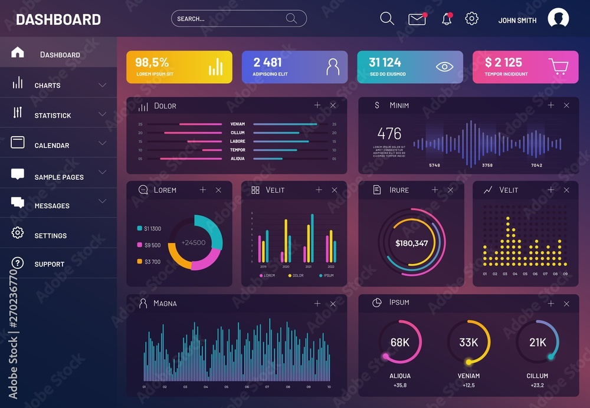

# Projeto Dashboard Básico

Basicamente este é um projeto de estudos para treinar o Frontend criando uma single-page-application com um menu lateral a esquerda que ajuda na navegação e o conteúdo da página fica a direita conforme apresentado na Figura a Baixo

[Fonte](https://stock.adobe.com/br/search?k=dashboard&asset_id=270236770)
